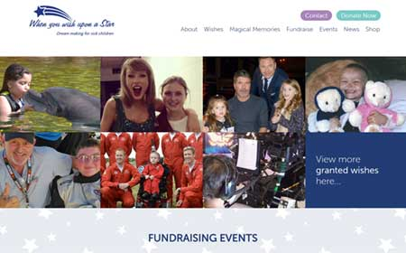
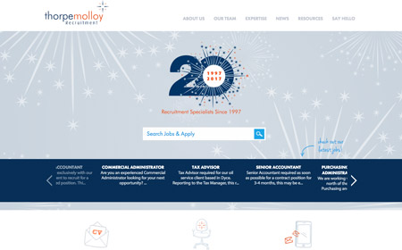
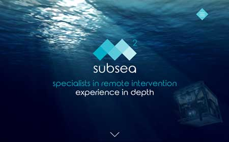
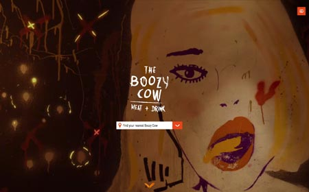

# Projects

## Recent web development projects

### [When you Wish Upon a Star](http://whenyouwishuponastar.org.uk)
_September 2017_

	

When you wish upon a star is a nationwide charity granting wishes to poorly children.

My role in this project was to develop the website from the ground up from designs provided by our designer. We chose an elegant CMS (Perch) that is easy for our client to update. From this CMS we generate event listings, granted wish stories and news articles.

I developed several API modules to pull custom JSON data objects from the CMS database, with the purpose of extending the CMS's functionality to support dynamically loaded article listings and plotting event locations on an embedded Google map.

In addition, I animated various elements throughout the site, such as the landing page slider animation, and the home page call to action icons.

The site is fully responsive and rigorously tested on a variety of devices.

Technologies used: PHP/MySQL, HTML5, SASS/CSS3, CMS, API, JS/jQuery, GSAP

[View project](http://whenyouwishuponastar.org.uk)

---
### [Thorpe Molloy Recruitment](http://thorpemolloy.com)
_June 2015 - Ongoing_

	

Thorpe Molloy Recruitment is an award winning specialist recruitment agency based in Aberdeen.

Internet Strategies has held a long standing relationship with Thorpe Molloy, supplying design and development services and providing unique solutions that give Thorpe Molloy's online presence an edge over competitors.

My role with this project started with the refreshing of the site in 2014. I redeveloped the front end experience based on designs provided by our designer. We built a fully responsive site that scaled well to all devices and was rigerously tested. We introduced CSS3 animation elments for icons and enquiry form roll in's that were bold and simple.

I also participated in the back end development of the site, my tasks including:
- Development of AJAX enquiry forms and PHP form handlers tasked with database CRUD and statistical reporting
- Implementation of the Perch CMS, allowing our client to update team members and news articles. The news section was also overhauled to support dnyamic loading and filtering of articles
- Creation of PHP software that performed batch operations on large databases of jobs/applicants
- Creation of PHP modules that interfaced with older portions of the custom developed CMS

Technologies used: PHP/MySQL, HTML5, SASS, CMS, JS/jQuery

[View project](http://thorpemolloy.com)

---
### [M2 Subsea](http://m2subsea.com)
_March 2017_

	

M2 Subsea is one of the largest independant providors of ROV and vessel services, project management, consulting and engineering.

My role in this project was to develop the site from prototype to delivery using HTML, CSS, jQuery and PHP.

The goal of this project was to provide a website that is as eye-catching and innovative as the ethos of the M2 Subsea brand. We achieved this by building a beautiful responsive site with serene video backdrops and subtly animated elements.

Of note:
- The Perch CMS is used for the news section of the site, for which we developed a template system that handled article categorisation
- The complex unfolding logo animation on the home page is an SVG graphic that I animated using CSS3 and the Greensock API.

Technologies used: PHP/MySQL, HTML5, SASS, CMS, JS/jQuery, GSAP

[View project](http://m2subsea.com)

---
### [The Boozy Cow](http://boozycow.com)
_January 2017_

	

The Boozy Cow is a chain of restaurants that donates 100% of its profits to local charities and good causes.

The goal of this project was to improve the end-user experience over the previous website by providing a fully responsive, eye-catching new site that echoed the grungy americana aesthetic of the Boozy Cow brand.

My role in this project was to provide full back/front end development, logo animation and device testing.

Technologies used: PHP/MySQL, HTML5, SASS, CMS, jQuery, GSAP

[View project](http://boozycow.com)

---
## Github Projects
| Project title | Description | Link | Technologies |
| --- | --- | --- | --- |
| [Fooderator](https://github.com/telekineticyeti/fooderator) | A meal planning app that simplifies keeping track of planned meals and which groceries you'll need for them, improving budgetting and reductions in food waste. |  | Node, AngularJS, Postgre SQL, SASS, Docker |
| [Arstation Likes Scraper](https://github.com/telekineticyeti/artstation-likes-scraper) | Scrape a user profile for their likes and download the associated image assets for those likes. |  | Node, API, Docker |
| [gHoard](https://github.com/telekineticyeti/ghoard) | An endpoint for swiftly hoarding files to Google drive using the Google auth and API libraries. Designed to be an endpoint for an IFTTT applet or for an app such as [Arstation Likes Scraper](https://github.com/telekineticyeti/artstation-likes-scraper) |  | Node, API, oAuth, Docker | 
| [Daenom](https://github.com/telekineticyeti/daenom) | An endpoint for [IFTTT applets](https://ifttt.com/). When queried, it will return an image/video/gif from a Twitter or Tumblr post, or a stitched-together image of a multi-image post. The result can be used by IFTTT to be saved to Cloud drives, emailed, etc. |  | PHP, ImageMagick, Composer, Docker, API |
| [Lazychrono](https://github.com/telekineticyeti/lazychrono) | A background app that automatically 'collect coins' from the videogame distribution site [Chrono.gg](https://www.chrono.gg/) |  | Node, JWT, API, Docker, Crontab |
| [InstaRSS](https://github.com/telekineticyeti/instarss) | Generate a standards compliant RSS feed of a user's public instagram posts |  | Node, API, XML, RSS, Docker |
| [Tumbledash](https://github.com/telekineticyeti/tumbledash) | A python project that will generate an RSS feed of your Tumblr dashboard using Tumblr's API. Allows you to see your followed posts in your RSS reader. |  | Python, API, oAuth, XML, RSS |
